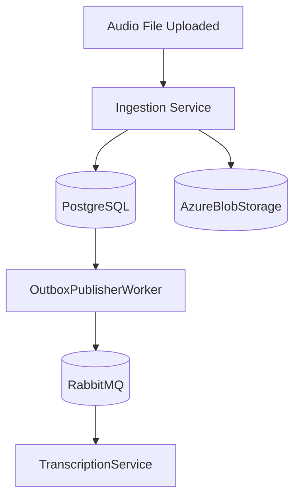

# CallSense

AI-powered customer service call QA platform. Automates QA review
of customer service calls using a distributed processing pipeline.

## Status
Phase 1 in progress — Ingestion service

## Architecture



## Tech Stack
- .NET 10, ASP.NET Core minimal APIs
- PostgreSQL + EF Core 10
- RabbitMQ + MassTransit
- Azure Blob Storage (Azurite locally)
- MediatR, FluentValidation, Polly

## Local Development

Prerequisites: .NET 10 SDK, Docker Desktop

```bash
# Start infrastructure
docker compose up -d

# Run Ingestion service
cd services/CallSense.Ingestion/src/CallSense.Ingestion.API
dotnet run

RabbitMQ UI: http://localhost:15672
Seq logs:    http://localhost:5341